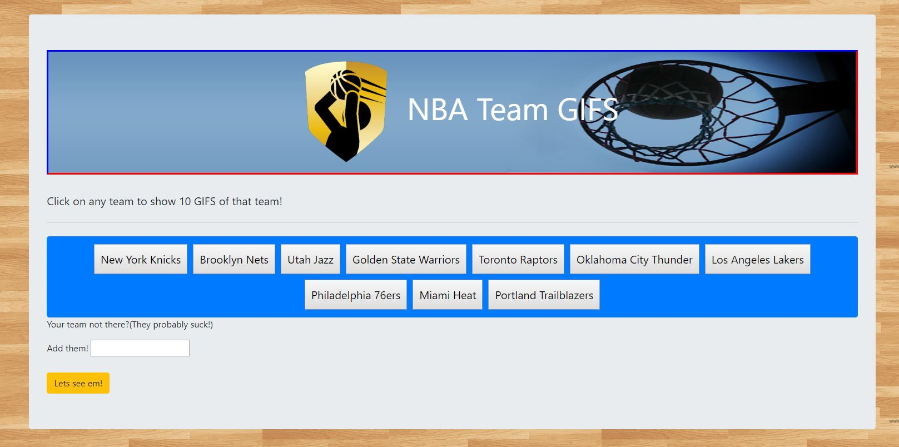

# [Never GIF Up](https://alexlo15.github.io/nevergifup/
)
RU-SOM-FSF-FT-06-2019-U-C | HW #6

___

## Motivation
Create an application that utilizes the giphy api. This homework was intended to help us understand API's. This site features an NBA team theme, users can search for GIFS of any NBA team.

## Technologies used and why

**Built with:**
* [GIPHY API](https://developers.giphy.com/)
* [Bootstrap](https://getbootstrap.com/)
* [HTML](https://www.w3schools.com/html/)
* [CSS](https://www.w3schools.com/css/)
* [JavaScript](https://www.javascript.com/)

 

## License
A short snippet describing the license (MIT, Apache etc)

MIT © 
[Alex Lo](https://github.com/alexlo15)

